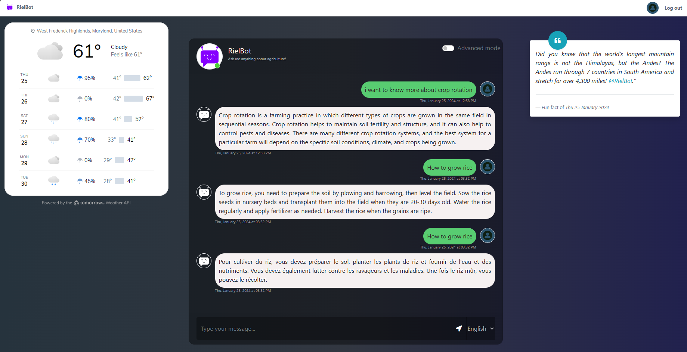

# RielBot Application Documentation



Link : [RielBot](https://rielbot.onrender.com/chatbot)

## Description

This application is an interactive chatbot that allows users to ask questions and receive answers generated by external services such as Google AI and Bing. The responses can be translated into the user's chosen language. The application also features user authentication functionality.

## Technologies Used

- Python/Flask
- PostgreSQL
- SQLAlchemy
- Jinja
- RESTful APIs
- JavaScript
- HTML
- CSS

## User Flows

1. **Registration**: New users can register by providing their information on the registration page.
2. **Login**: Existing users can log in by providing their credentials on the login page.
3. **Interacting with the Chatbot**: Users can interact with the chatbot by sending messages through the chat form.
4. **Receiving Responses**: Users receive a response from the chatbot after sending a message.
5. **Logout**: Users can log out of the application at any time.
6. **Advanced Mode**: This mode allows the bot to add more informations in his answer like some links and other questions sections.

## RielBot API
    # API Documentation: /api/rielbot Endpoint

### Overview

The `/api/rielbot` endpoint is designed to handle user login, process messages sent by the user, and provide appropriate responses. It supports POST requests where users can send their credentials along with a message and a preferred language for the response.

### Endpoint

`POST /api/rielbot`

### Functionality

1. **User Authentication**: Validates user credentials (username and password).
2. **Message Processing**: If the user is authenticated and a message is provided, the message is processed to generate a response.
3. **Language Handling**: Supports translating the response into the user's chosen language.
4. **Database Interaction**: Saves the user's message and the AI-generated response in the database.
5. **Response Handling**: Returns a JSON response with the status and message or error details.

### Request Format

The request should be a JSON object containing the following keys:
- `username`: User's username (string)
- `password`: User's password (string)
- `message`: Message to be processed (optional, string)
- `language`: Preferred language for the response (optional, defaults to English, string)

Example:
```json
{
  "username": "user123",
  "password": "password123",
  "message": "How's the weather today?",
  "language": "fr"
}
```


## Installation and Usage

1. Clone the repository to your local machine.
2. Install dependencies using `pip install -r requirements.txt`.
3. Set up your PostgreSQL database.
4. Define your environment variables for the database and API keys.
5. Launch the application using `flask run`.
6. Open your browser and go to `localhost:5000` to use the application.
